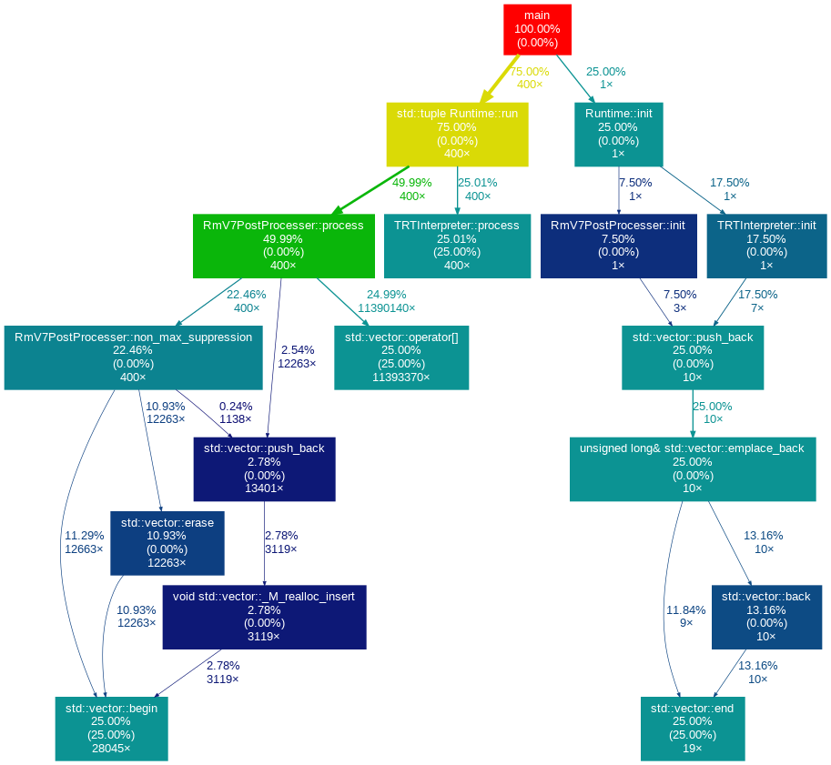

# 程序性能检测可视化方法

| 版本 | 日期       | 人员                     | 修改记录                                                     |
| ---- | ---------- | ---------------------- | ------------------------------------------------------------ |
| v1.0 | 2024-9-01 | 关超, 23049200367@qq.com  | 添加程序性能检测可视化方法文档          |

## 1, ---`gprof`---
`gprof` 是一个GNU项目下的性能分析工具，主要用于分析C和C++程序的执行效率。它可以提供程序中各函数的执行时间、调用次数以及函数间的调用关系
### 编译环节
在编译的时候需要加上`-pg`的参数才能进行后面的步骤
```shell
gcc -pg -o name test.cpp
```
对于`cmake`可以使用
```cmake
set (CMAKE_CXX_FLAGS "${CMAKE_CXX_FLAGS} -pg")
```
注意在编译程序的时候可能需要将优化选项`-o1 -o2 -o3`关了，不然有些调用函数的时间就无法正确显示
### 运行程序
运行可执行文件之后会产生一个叫`gmon.out`的文件，其中包含了分析所要的原始数据
### 分析数据
```shell
gprof ./name gmon.out > output.txt
```
output.txt 中会有类似下面内容的东西
```
Flat profile:

Each sample counts as 0.01 seconds.

  %   cumulative   self              self     total           

 time   seconds   seconds    calls  ms/call  ms/call  name    

 50.00      0.01     0.01                             main

 50.00      0.02     0.01        2     5.00     5.00  func1

  0.00      0.02     0.00        1     0.00     0.00  func2
```

在这一步中可以添加一些参数

| 命令                                                                     | 中文解释             | 英文解释                                                             |
| ---------------------------------------------------------------------- | ---------------- | ---------------------------------------------------------------- |
| gprof [options] [executable-file [profile-data-files…]] [> outputfile] | Gprof命令行格式       | Gprof command line format                                        |
| -b                                                                     | 简洁输出，不显示冗长的解释    | Brief output. Do not display verbose explanations                |
| -s                                                                     | 将多个gmon.out文件合并  | Summarize: merge several profile data files for cumulative stats |
| -p                                                                     | 显示程序的每个函数的执行时间统计 | Display program’s functions execution time statistics            |
| -q                                                                     | 显示程序的每个函数的调用关系   | Display program’s functions call graph                           |
### 输出和可视化
`gprof`的输出主要包含两部分：函数调用图(Call Graph)和函数列表(Function List)
#### 使用 `gprof2dot` 工具
安装
```shell
pip install gprof2dot
sudo apt-get install graphviz
```
使用下面这段代码一步到位
```shell
gprof name | gprof2dot -s | dot -Tpng -o output.png

```


### `Gprof`的替代工具介绍

|工具名称|适用场景|优点|缺点|
|---|---|---|---|
|Valgrind|内存泄漏检测，性能分析|功能强大，支持多种性能分析任务|运行速度慢|
|gperftools|CPU和堆栈性能分析|高效，适用于生产环境|使用复杂度高|
|OProfile|系统级性能分析|可以分析内核和硬件性能|需要管理员权限|
[详细参考链接](https://developer.aliyun.com/article/1467209)
